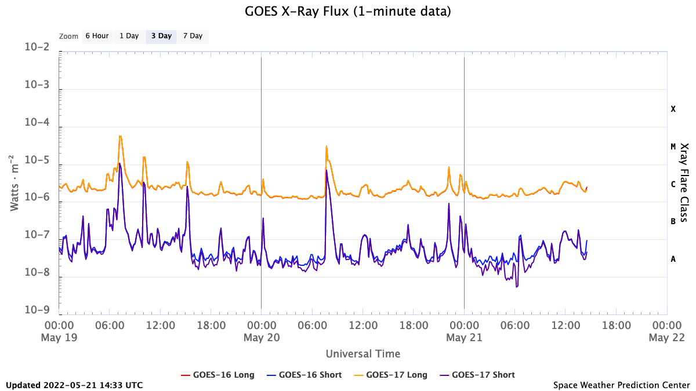

Introduction to Solar Flares
============================

Adapted from
`NASA's description <https://www.nasa.gov/content/goddard/what-is-a-solar-flare>`_:

Solar flares are intense radiation bursts
resulting from the release of magnetic energy associated with
sunspots. As the largest explosive events in our solar system,
flares are noticeable as bright areas on the sun and can last from
minutes to hours.

Solar flares primarily release photons, observable across
all wavelengths of the spectrum. X-rays and extreme ultraviolet
light, in particular, are particularly important
for monitoring flare activities.
Flares also serve as acceleration sites for particles (electrons,
protons, and heavier particles).

  .. image:: images/Solar_flare_2_March.gif
     :width: 400
In the picture above, you see the Sun unleashing a powerful flare that
generates X-ray emission.
The event was captured by the Extreme Ultraviolet Imager EUI, and the
X-ray Telescope STIX
aboard the Solar Orbiter spacecraft
(Credit: ESA).

The X-ray flux emitted by the sun plays a fundamental role in
monitoring solar activity.
The Geostationary Operational Environmental Satellite (GOES) series,
equipped with x-ray instruments, provides nearly real-time data
that is updated every minute.

During an x-ray flare, the X-ray flux rapidly increases
to its peak over 10 - 20 minutes, then gradually returns to
background levels over the subsequent 1 to 2 hours.

The illustration above shows monitoring of solar flux
over a span of almost three days. Each peak recorded
indicates a solar flare.

Here is the current (live!) solar activity of the sun:
https://www.swpc.noaa.gov/products/goes-x-ray-flux
from wich the Solar Flare Alert Lamp always uses the last available value.

Our Solar Flare Alert Lamp gradually increases the intensity of the
LED with increasing flux. It is turned off in absence of activity.
It flashes to signify a
solar flare in progress when the X-ray flux exceeds
M1 (1 x 10E-5 Watts/m2). Such events are indeed exciting to observe!