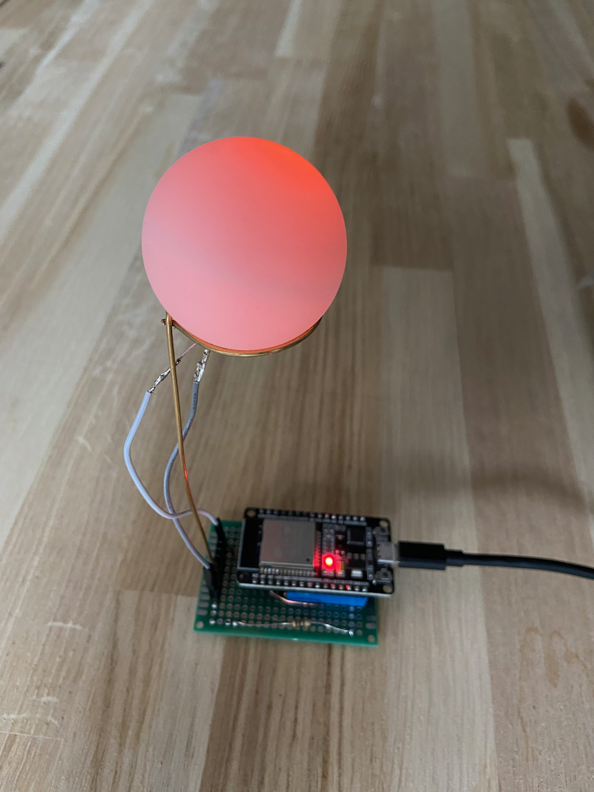

Instructions for the building the green version
===============================================

This is very similar to the instructions for the white breadboard

You will need:

* A table tennis ball
* One green breadboard
* Wires
* Soldering material
* One LED with LED plastic holder
* Three wire holder
* One ESP32 development board
* One 110 Ohm resistor

How to proceed:
^^^^^^^^^^^^^^^

#. Take the tennis ball and carefully create a small hole in it, ensuring it’s not too large but sufficient to mount the LED holder. To achieve this, I use a fine awl to start the hole and then gently enlarge it with precision pliers.#. Connect a wire at each end of the LED
#. Mount the LED holder into the hole of the tennis ball
#. Now, assemble the wire holder, ensuring that one end of each wire is connected to the LED. Take care to note that the longer “leg” of the LED should be connected to the ground.#. Solder the wire holder on the breadboard
#. Take the ESP32 and look at the pin. Locate the pin number 27
#. Solder the two wire holders on the breadboard such that they can accommodate the dev board later
#. Solder a wire from the ground to the ground line of the breadboard
#. Solder the resistor at a free space of the breadboard
#. Solder a wire from the pin 27 of the processor to the resistor
#. Solder a wire from the resistor to the one side of the wire holder
#. Solder a wire from the ground pin of the dev board to the other side of the wire holder
#. Plug it in and test it with Thonny, see also `Usage`__ or continue reading

__ esp32.html