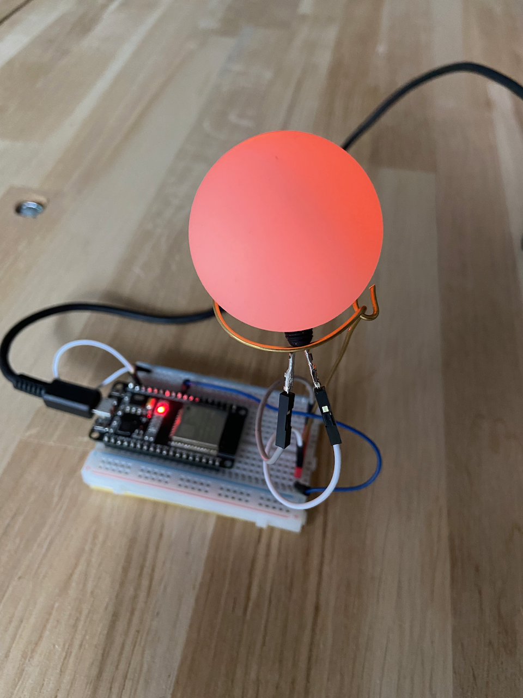

Instructions for the green breadboard
=====================================

This is very similar to the instructions for the white breadboard

You will need:

* A tennis ball
* One green breadboard
* Wires
* Soldering material
* One LED
* Three wire holder
* One ESP32 development board
* One 110 Ohm resistor

How to proceed:
^^^^^^^^^^^^^^^

#. Take the tennis ball, and make a hole in it, not too big, but sufficient to be able to mount the LED hold
#. Put a wire at each end of the LED
#. Insert the LED into the hole of the tennis ball
#. Now, assemble the wire holder, with, at both ends one of the wire of the LED. Pay attention that the longer "foot" of the LED will be connected to the ground
#. Solder the wire holder on the breadboard
#. Take the ESP32 and look at the pin. Locate the pin number 27
#. Solder the two wire holders on the breadboard such that they can accommodate the dev board later
#. Solder a wire from the ground to the ground line of the breadboard
#. Solder the resistor at a free space of the breadboard
#. Solder a wire from the pin 27 of the processor to the resistor
#. Solder a wire from the resistor to the one side of the wire holder
#. Solder a wire from the ground pin of the dev board to the other side of the wire holder
#. Plug it in and test it with Thonny, see also `Usage`__ or continue reading

__ esp32.html