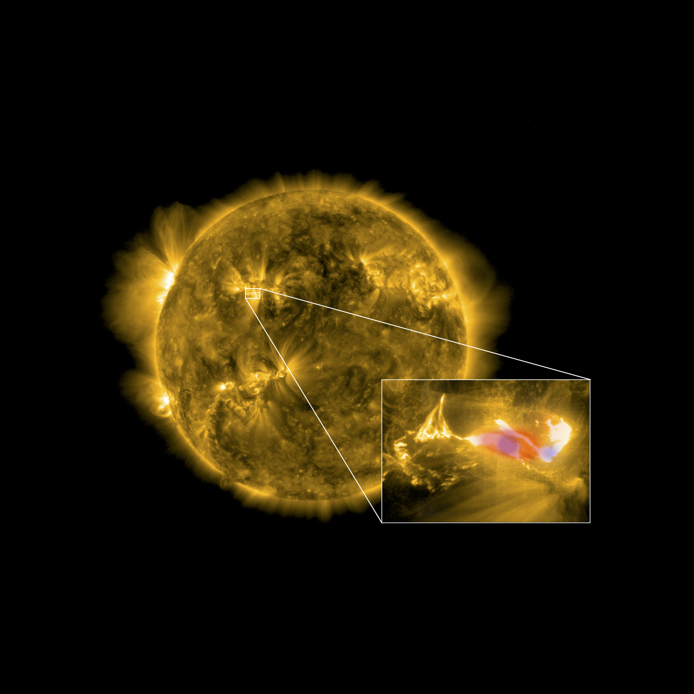

A general introduction to solar flares
======================================

From https://www.nasa.gov/content/goddard/what-is-a-solar-flare:

A solar flare is an intense burst of radiation coming from the release of
magnetic energy associated with sunspots.
Flares are our solar system’s largest explosive events.
They are seen as bright areas on the sun and they can last from minutes to hours.
We typically see a solar flare by the photons (or light) it releases,
at most every wavelength of the spectrum. The primary ways we monitor flares are in x-rays and extreme
ultraviolet light.

Flares are the sites where particles (electrons, protons, and heavier particles) are accelerated.

The Sun unleashed a powerful flare on 4 November 2003. The Extreme ultraviolet Imager in the 195A emission line aboard the SOHO spacecraft captured the event. Credit:  ESA & NASA/S

The X-ray flux emitted by the sun is used to monitor solar activity. The spacecraft series GOES include
an x-ray instrument that provides data
near to real-time, an is updated every minute.
During an x-ray flare the x-ray flux increases rapidly over 10 - 20 minutes to a maximum,
before returning to background levels over another 1 to 2 hours.

.. figure:: ../images/goes-x-ray-flux-1-minute.png
   :width: 400

An example showing the solar flux monitoring over almost three days. All the peaks are solar flares.

When the x-ray flux exceeds M1 (1 x 10E-5 Watts/m2), the solar flare alert starts flashing to indicate
that a solar flare is in progress (very exciting!).