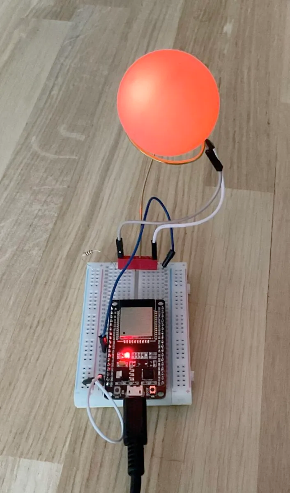

Instructions for the white breadboard
=====================================

You will need:

* A table tennis ball
* One white breadboard
* Wires
* One LED with an LED holder
* One wire holder
* One ESP32 development board
* One 110 Ohm resistor

How to proceed:
^^^^^^^^^^^^^^^

#. Take the tennis ball and make a small hole in it,
large enough to mount the LED holder.
#. Connect a wire to each end of the LED.
#. Insert the LED holder into the hole in the tennis ball.
#. Assemble the wire holder
with one wire of the LED attached to each end.
Ensure that the longer "leg" of the LED is connected to the ground wire.
#. Mount the wire holder on the breadboard.
#. Locate pin number 27 on the ESP32 development board.
#. Plug the ESP32 development board into the breadboard.
#. Connect a wire from the ground pin of the ESP32 board to the
ground line on the breadboard.
#. Insert the resistor into a free space on the breadboard.
#. Connect a wire from pin 27 of the ESP32 board to one end of the
resistor.
#. Connect another wire from the other end of the resistor to
one side of the wire holder.
#. Connect a wire from the ground line on the
breadboard to the other side of the wire holder.
#. Plug in the ESP32 development board and test the
setup using Thonny. For usage instructions,
refer to the `Usage`__ section or continue reading.

__ esp32.html